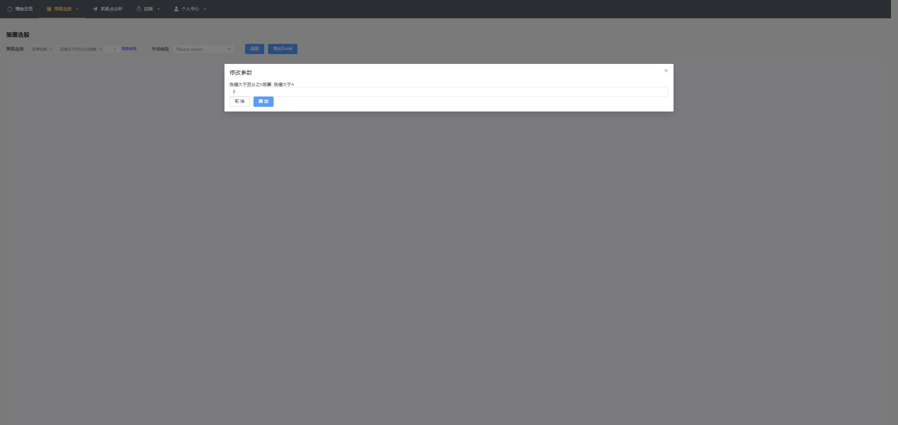
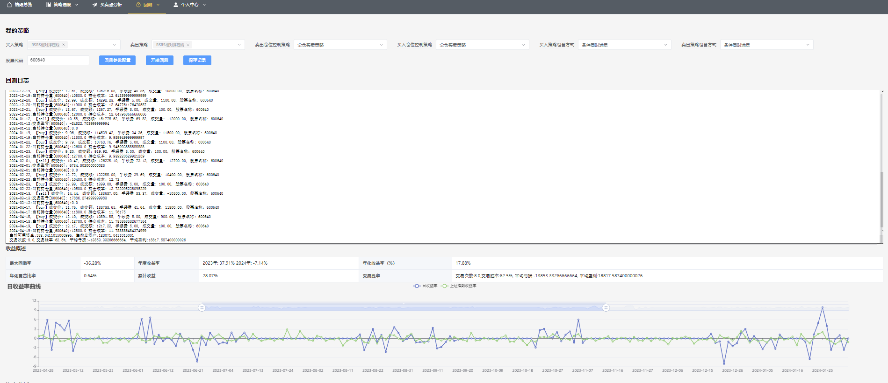

# 项目演示
## 1 市场总览
市场总览界面主要目的是了解市场情绪。目前简单分为:三大指数、市场热度、竞价上涨幅度分布、涨跌停板块分析、涨跌停市值分析。

**图1.1 大盘基本信息**

  

**图1.2 竞价上涨幅度分布**

**图1.3 涨停分析**

## 2 选股
目的是用自定义的因子进行选股，分为实时数据选股和历史数据选股，用户可自行编写选股因子。  

**图2.1 参数配置**
  

**图2.2 数据表格**
 

## 3 买卖点分析
这里在k线上可视化一些指标的计算结果。

**图3.1 买卖点分析**
 

## 4 回测
根据开发的策略利用历史数据进行收益测试。

**图4.1 回测界面**
 

**图4.2 收益及买卖点可视化**
 

**图4.3 回测参数配置**
 

## 5 回测记录查看
保存记录后可在此处查看历史回测结果和参数。

**图5.1 回测记录**
 

## 6 演示视频
<video id="video" controls="" preload="none">
      <source id="mp4" src="_static/demo.mp4" type="video/mp4">
</videos>