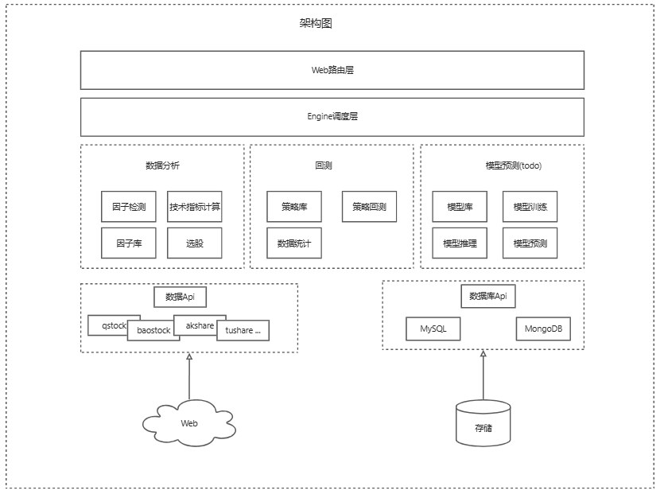

# 项目介绍
## 1 项目概述
Smart-Stock可以是一个复盘及量化策略回测的项目，初衷是利用开源数据做一个开源的项目，用于学习和研究。虽然市面上有很多回测的网站，但大多长期使用需要收费且个人用户一般很难获得可以本地开发调试的SDK，且需要熟悉api接口有一定学习成本。Smart-Stock是一个完全利用开源工具搭建的回测系统，目前只支持A股股票数据分析和回测。
## 2 系统架构图
理想中结构图如下所示，该仓模型预测部分暂时不支持。

## 3 免责声明
该项目仅用于学习研究，如用于商业行为请获得作者许可。
## 4 交流&合作
邮箱：qingyuan_li9@163.com
## 5 未来计划
后续会继续优化维护并且支持新的功能，欢迎社区开发者进行二次开发、扩展。